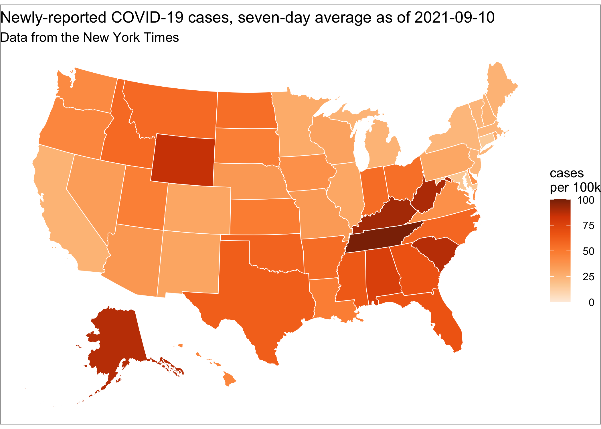
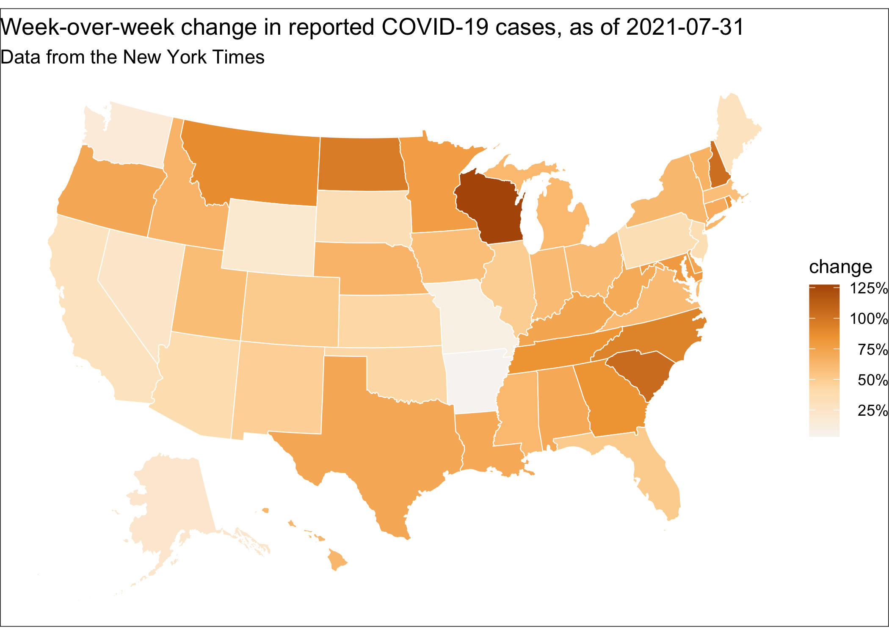

# covidStates

<!-- badges: start -->

<!-- badges: end -->

The purpose of this repository is to demonstrate the use of [projthis](https://ijlyttle.github.io/projthis/), an R package for managing project-based workflows.
The demonstration is an analysis of daily reported COVID-19 cases in the US, using [data provided by the New York Times](https://github.com/nytimes/covid-19-data).

Here's a rough outline of the process supported by the projthis package:

1.  Create an R project.

2.  Within the project, create a *workflow*, an ordered series of RMarkdown files.

3.  Within the workflow, develop the RMarkdown files to conduct an analysis.

4.  Collect the project's package-dependencies in the `DESCRIPTION` file.

5.  Render the workflow.
    If you like, you can render the workflow on a schedule, using GitHub Actions.

*This* workflow creates a couple of ggplots:





## Procedure

Here, we describe the "rough-outline" in a little more detail:

1.  Create the project:

    ``` r
    projthis::proj_create("path/to/covidStates")
    ```

    At this point, a new RStudio IDE window opens with the new project.
    Customize the [DESCRIPTION](DESCRIPTION) file with title, description, authors, etc., then:

    ``` r
    # add license (pick one you like)
    usethis::use_mit_license()

    # establish git repository
    usethis::use_git()   
    ```

    The RStudio IDE is restarted, then:

    ``` r
    # put repository on GitHub
    usethis::use_github()

    # create this README file
    usethis::use_readme_md()
    ```

2.  Create a workflow:

    A workflow consists of a sequence of RMarkdown files and a corresponding sequence of data directories.
    When creating a workflow, you can specify to git-ignore the data directory.

    In this case, the data is relatively small (maybe a few MB).
    The data is kept as a part of the git repository, i.e. is not git-ignored.
    To create the workflow directory:

    ``` r
    projthis::proj_use_workflow("workflow", git_ignore_data = FALSE)
    ```

    This creates a directory called `workflow`, with a `README.Rmd`.
    It also creates a `data` directory inside the `workflow` directory.

3.  Create the workflow itself; see this workflow's [README](workflow).

4.  Collect the project's package-dependencies in the `DESCRIPTION` file:

    ``` r
    projthis::proj_update_deps()
    ```

5.  Render the workflow:

    ``` r
    projthis::proj_render_workflow("workflow")
    ```

    To automate the workflow, you can create a GitHub Action from a template:

    ``` r
    projthis::proj_workflow_use_action()
    ```

    This action is adapted from the [r-lib/actions](https://github.com/r-lib/actions) repository.
    Given a triggering event, it will:

    -   check out the repository
    -   set up R
    -   install the package-dependencies listed in its `DESCRIPTION` file
    -   render the workflow(s)
    -   commit the results back to GitHub

    There are two, possibly three, things to customize:

    -   Triggering the action:

        ``` yaml
        on:
          # runs whenever you push any Rmarkdown file
          push:
            paths:
              - "**.Rmd"
          # runs on a schedule using UTC - see https://en.wikipedia.org/wiki/Cron
          schedule:
           - cron:  '00 08 * * *' # 08:00 UTC every day
        ```

        The first section describes an event where any RMarkdown file is changed, i.e. the workflow process changes.
        This trigger is operative on all remote branches of the repository.

        The second section describes a schedule; this trigger operative only on the default GitHub branch of the repository.
        It is useful for situations, like this one, where the upstream data changes, thus compelling automatic updates.
        In the template, the schedule is commented out; it should not be activated until you are confident the Action is doing what you expect it to do.
        Of course, you should tweak the schedule to meet your needs.

    -   Rendering the workflow:

        ``` yaml
        - name: Render workflow
          run: |
            projthis::proj_workflow_render("workflow")
          shell: Rscript {0}
        ```

        In the template, the call to `projthis::proj_workflow_render()` is commented out - you'll want to uncomment it and ensure that it refers to the right directory.
        Of course, if your repository contains more than one workflow, you can make additional calls to `projthis::proj_workflow_render()`.

    -   Deploying the project:

        In this case, the Action commits the results back into the branch that it checked out.
        As a consequence, when working with a branch that exists both locally and at GitHub, be sure to pull updates from the GitHub remote before you start working on it; you are now sharing the branch with GitHub Actions.

        ``` yaml
        - name: Deploy results
          run: |
            git config --local user.email "actions@github.com"
            git config --local user.name "GitHub Actions"
            git add -u
            git commit -m "updated by Actions"  || echo "No changes to commit"
            git push  || echo "No changes to commit"
        ```

        The trick here is to find the right specification to add files to the commit.
        The template provides `git add -u`, which adds only those files that are already exist in the branch, i.e, an update.
        Hopefully this works in most instances; depending on your situation you might have to get a bit creative.

        [**Be wary**](https://twitter.com/JennyBryan/status/1319320033063923712) using of using `git add -A` as you may end up committing files that you would prefer not to commit.
