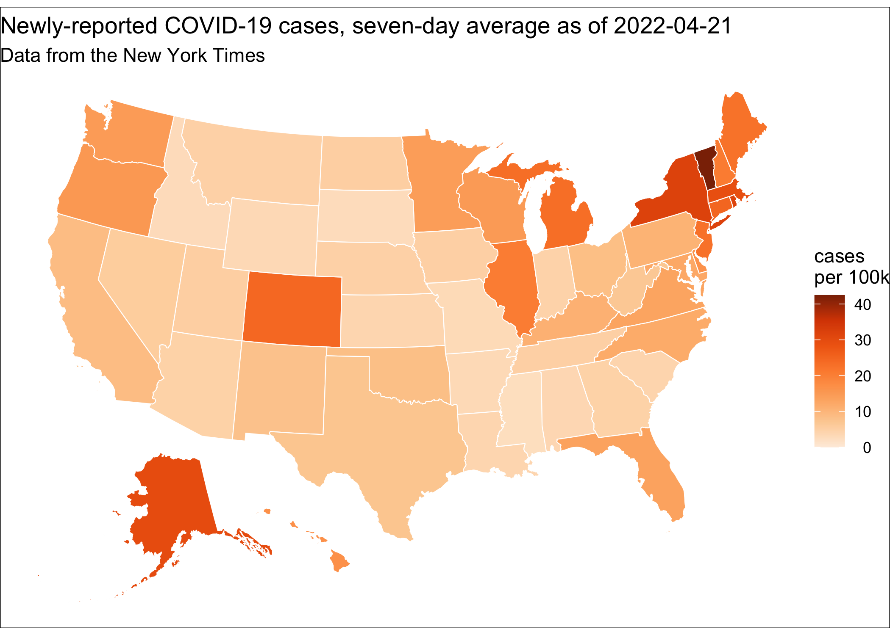

# covidStates

<!-- badges: start -->
<!-- badges: end -->

The purpose of this repository is to show how to use the [projthis](https://ijlyttle.github.io/projthis/) package to manage a project-based workflow. 
The particular case will be to create a workflow that a daily update these COVID-related graphics:




## Procedure 

These are the steps I have taken to get to this point:

1. Created the project using:

   ```r
   projthis::proj_create("path/to/covidStates")
   ```
  
   At this point, a new RStudio IDE window opens with the new project.

1. Customized the [DESCRIPTION](DESCRIPTION) file, then:

   ```r
   # add license (pick one you like)
   usethis::use_mit_license()
   
   # establish git repository
   usethis::use_git()   
   ```

   The RStudio IDE is restarted, then:
   
   ```r
   # put repository on GitHub
   usethis::use_github()
   
   # create this README file
   usethis::use_readme_md()
   ```

   After beginning this README file, the repository is in [this state](https://github.com/ijlyttle/covidStates/tree/initialize).

1. Created a workflow directory. 
   This is meant to be a "data-universe" with defined points for importing and publishing data; between these points is where the action is.
   
   A workflow is composed of a sequence of RMarkdown files and a corresponding sequence of data directories.
   The default is that each RMarkdown file is rendered as a `github_document`, facilitiating easy browsing on the GitHub web portal, while still enabling "private-mode". Compared with current RMarkdown capabilities, this is a decidedsly minimalist approach. 
 
   The data is relatively small (maybe a few MB), so I will keep it as a part of the git repository, i.e. I will not git-ignore it.
   To create the directory:
  
   ```r
   proj_use_workflow("workflow", git_ignore_data = FALSE)
   ```
   
   This creates a directory called `workflow`, with a `README.Rmd`. 
   It also creates a `data` directory inside the `workflow` directory, which will not appear in the git repository until files are committed to it.
   
   At this point, the repository is in [this state](https://github.com/ijlyttle/covidStates/tree/create-workflow).
   You can also check out the [changes](https://github.com/ijlyttle/covidStates/pull/2/files) from the previous state.
   
1. To see the process of putting together the workflow directory, see its [README](workflow).

1. To automate the workflow, you can create a GitHub Action from a template, using:

   ```
   projthis::proj_workflow_use_action()
   ```

   This action is adapted from the [actions](https://github.com/r-lib/actions) repository, it will, given a triggering event:
   
   - check out your repository
   - set up R
   - install the package-dependencies listed in your `DESCRIPTION` file
   - build your project 
   - commit the results back to GitHub
   
   There are two things you will need to customize:
   
   - Define the triggering events:
   
     ```yaml
     on:

       # runs whenever you push any Rmarkdown file
       push:
         paths:
           - "**.Rmd"
   
       # runs on a schedule using UTC - see https://en.wikipedia.org/wiki/Cron
       schedule:
        - cron:  '00 00,08,16 * * *' # 00:00, 08:00, 16:00 UTC every day
     ```
    
     The first trigger used happens when any RMarkdown file is changed, i.e. your workflow process changes.
     
     The second trigger, the schedule, is commented out in the template, and should not be activated unless you are importing data that changes. 
     For example, the NYT updates their COVID-19 data every day. 
     Furthermore, you should not activate it (by uncommenting) until you are confident the Action is doing what you expect it to do. Of course, you should tweak the schedule to meet your needs.
    
     Schedules are run on the default branch of the repository. 
     If you are working with the branch locally, be sure to pull any updates before you start working on it; you are not the only active user.
    
   - Define what happens when it builds your project:
   
     ```yaml
     - name: Render workflow
       run: |
         projthis::proj_workflow_render("workflow")
       shell: Rscript {0}
     ```
     
     You'll want to uncomment this from the template. 
     Of course, if your repository contains more than one workflow, you can add additional calls to `projthis::proj_workflow_render()`.
