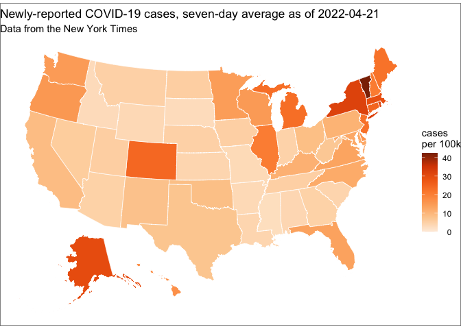

Analyze data
================
Compiled at 2020-12-27 05:03:35 UTC

``` r
here::i_am(paste0(params$name, ".Rmd"), uuid = "a4069103-4402-4559-ba03-cca3df086442")
```

    ## here() starts at /Users/runner/work/covidStates/covidStates/workflow

``` r
library("conflicted")
library("projthis")
library("here")
library("readr")
library("dplyr")
library("albersusa")
library("ggplot2")
library("glue")
```

    ## 
    ## Attaching package: 'glue'

    ## The following object is masked from 'package:dplyr':
    ## 
    ##     collapse

``` r
conflict_prefer("filter", "dplyr")
```

    ## [conflicted] Removing existing preference

    ## [conflicted] Will prefer dplyr::filter over any other package

``` r
conflict_prefer("lag", "dplyr")
```

    ## [conflicted] Will prefer dplyr::lag over any other package

The purpose of this document is to create some state-based maps that
show the current trajectory of COVID-19 cases. There will be two maps:

  - seven-day average of newly-reported cases
  - change in newly-reported cases vs. previous seven days

<!-- end list -->

``` r
# create target directory to write *this* file's data: 
#  - all data written by this file should be written here
proj_create_dir_target(params$name)

# create accessor functions for data directories:
#  - get path to target directory: path_target("sample.csv")
#  - get path to previous data: path_data("00-import", "sample.csv")
path_target <- proj_path_target(params$name)
path_data <- proj_path_data(params$name)
```

## Read data

``` r
population <- 
  read_csv(
    path_data("01-clean", "population.csv"),
    col_types = cols(state = "c", population = "d")
  ) %>%
  print()
```

    ## # A tibble: 51 x 2
    ##    state                population
    ##    <chr>                     <dbl>
    ##  1 Alaska                   731545
    ##  2 Alabama                 4903185
    ##  3 Arkansas                3017804
    ##  4 Arizona                 7278717
    ##  5 California             39512223
    ##  6 Colorado                5758736
    ##  7 Connecticut             3565287
    ##  8 District of Columbia     705749
    ##  9 Delaware                 973764
    ## 10 Florida                21477737
    ## # … with 41 more rows

``` r
covid <- 
  read_csv(
    path_data("01-clean", "covid.csv"),
    col_types = cols(
      date = "D", 
      state = "c", 
      fips = "c", 
      cases = "d", 
      deaths = "d"
    )
  ) %>%
  print()
```

    ## # A tibble: 15,270 x 5
    ##    date       state      fips  cases deaths
    ##    <date>     <chr>      <chr> <dbl>  <dbl>
    ##  1 2020-01-21 Washington 53        1      0
    ##  2 2020-01-22 Washington 53        1      0
    ##  3 2020-01-23 Washington 53        1      0
    ##  4 2020-01-24 Illinois   17        1      0
    ##  5 2020-01-24 Washington 53        1      0
    ##  6 2020-01-25 California 06        1      0
    ##  7 2020-01-25 Illinois   17        1      0
    ##  8 2020-01-25 Washington 53        1      0
    ##  9 2020-01-26 Arizona    04        1      0
    ## 10 2020-01-26 California 06        2      0
    ## # … with 15,260 more rows

``` r
growth <- function(x) {
  # week-over-week growth, normalized by previous week
  
  # use "+ 1" in denominator to avoid division by zero
  result <- (x - dplyr::lag(x, 7)) / (dplyr::lag(x, 7) + 1) 
  
  # three digits should be more than enough
  round(result, 3)
}

per_100k <- function(x, pop) {
  result <- x / (pop / 1e5)
  
  round(result, 3)
}

covid_week <-
  covid %>%
  left_join(population, by = "state") %>%
  group_by(state) %>%
  arrange(date) %>%
  transmute(
    date,
    state,
    cases_total = cases, 
    cases_total_per100k = per_100k(cases_total, population),
    cases_avg_week = (cases - lag(cases_total, 7)) / 7,
    cases_avg_week_per100k = per_100k(cases_avg_week, population),
    cases_week_growth = growth(cases_avg_week),
    deaths_total = deaths,
    deaths_total_per100k = per_100k(deaths_total, population),
    deaths_avg_week = (deaths - lag(deaths_total, 7)) / 7,
    deaths_avg_week_per100k = per_100k(deaths_avg_week, population),
    deaths_week_growth = growth(deaths_avg_week)
  ) %>%
  print()
```

    ## # A tibble: 15,270 x 12
    ## # Groups:   state [51]
    ##    date       state cases_total cases_total_per… cases_avg_week cases_avg_week_…
    ##    <date>     <chr>       <dbl>            <dbl>          <dbl>            <dbl>
    ##  1 2020-01-21 Wash…           1            0.013             NA               NA
    ##  2 2020-01-22 Wash…           1            0.013             NA               NA
    ##  3 2020-01-23 Wash…           1            0.013             NA               NA
    ##  4 2020-01-24 Illi…           1            0.008             NA               NA
    ##  5 2020-01-24 Wash…           1            0.013             NA               NA
    ##  6 2020-01-25 Cali…           1            0.003             NA               NA
    ##  7 2020-01-25 Illi…           1            0.008             NA               NA
    ##  8 2020-01-25 Wash…           1            0.013             NA               NA
    ##  9 2020-01-26 Ariz…           1            0.014             NA               NA
    ## 10 2020-01-26 Cali…           2            0.005             NA               NA
    ## # … with 15,260 more rows, and 6 more variables: cases_week_growth <dbl>,
    ## #   deaths_total <dbl>, deaths_total_per100k <dbl>, deaths_avg_week <dbl>,
    ## #   deaths_avg_week_per100k <dbl>, deaths_week_growth <dbl>

It might also be useful to have files for the most-recent day, each for
cases and deaths.

``` r
covid_recent_cases <- 
  covid_week %>%
  filter(date == max(date)) %>%
  select(date, state, starts_with("cases")) %>%
  arrange(desc(cases_avg_week_per100k)) %>%
  print()
```

    ## # A tibble: 51 x 7
    ## # Groups:   state [51]
    ##    date       state cases_total cases_total_per… cases_avg_week cases_avg_week_…
    ##    <date>     <chr>       <dbl>            <dbl>          <dbl>            <dbl>
    ##  1 2020-12-25 Cali…     2064511            5225.         36418              92.2
    ##  2 2020-12-25 Tenn…      532375            7796.          6010.             88.0
    ##  3 2020-12-25 Ariz…      486993            6691.          6136.             84.3
    ##  4 2020-12-25 Alab…      342426            6984.          3820.             77.9
    ##  5 2020-12-25 Okla…      272553            6888.          2970.             75.1
    ##  6 2020-12-25 Arka…      213267            7067.          2264.             75.0
    ##  7 2020-12-25 Indi…      491125            7295.          5014.             74.5
    ##  8 2020-12-25 West…       78836            4399.          1298.             72.4
    ##  9 2020-12-25 Dela…       53653            5510.           649.             66.7
    ## 10 2020-12-25 Miss…      204178            6860.          1967.             66.1
    ## # … with 41 more rows, and 1 more variable: cases_week_growth <dbl>

``` r
covid_recent_deaths <- 
  covid_week %>%
  filter(date == max(date)) %>%
  select(date, state, starts_with("deaths")) %>%
  arrange(desc(deaths_avg_week_per100k)) %>%
  print()
```

    ## # A tibble: 51 x 7
    ## # Groups:   state [51]
    ##    date       state deaths_total deaths_total_pe… deaths_avg_week
    ##    <date>     <chr>        <dbl>            <dbl>           <dbl>
    ##  1 2020-12-25 Sout…         1430            162.             14.3
    ##  2 2020-12-25 Arka…         3438            114.             42.7
    ##  3 2020-12-25 Penn…        14892            116.            175. 
    ##  4 2020-12-25 Iowa          3744            119.             41.9
    ##  5 2020-12-25 West…         1247             69.6            22.3
    ##  6 2020-12-25 New …         2309            110.             25.9
    ##  7 2020-12-25 Ariz…         8409            116.             84.3
    ##  8 2020-12-25 Alab…         4680             95.4            54.9
    ##  9 2020-12-25 Miss…         5633             91.8            66.1
    ## 10 2020-12-25 Indi…         7770            115.             72.1
    ## # … with 41 more rows, and 2 more variables: deaths_avg_week_per100k <dbl>,
    ## #   deaths_week_growth <dbl>

Let’s make some choropleth maps using
[ggplot2](https://ggplot2.tidyverse.org/).

``` r
map_recent_cases <- 
  usa_sf("laea") %>%
  left_join(covid_recent_cases, by = c(name = "state"))

date <- max(covid_recent_cases$date)

gg_cases <-
  ggplot(map_recent_cases, aes(fill = cases_avg_week_per100k)) +
  geom_sf(size = 0.25, color = "white") + 
  scale_fill_distiller(
    palette = "Oranges", 
    direction = 1,
    limits = c(0, NA)
  ) +
  labs(
    title = glue("Newly-reported COVID-19 cases, seven-day average as of {date}"),
    subtitle = "Data from the New York Times",
    fill = "cases\nper 100k"
  ) +
  theme_void() + 
  theme(
    legend.text.align = 1 # right-justify
  )

gg_cases
```

<!-- -->

``` r
# see https://github.com/tidyverse/ggplot2/issues/3738#issuecomment-583750802
mid_rescaler <- function(mid = 0) {
  function(x, to = c(0, 1), from = range(x, na.rm = TRUE)) {
    scales::rescale_mid(x, to, from, mid)
  }
}

gg_change <-
  ggplot(map_recent_cases, aes(fill = cases_week_growth)) +
  geom_sf(size = 0.25, color = "white") + 
  scale_fill_distiller(
    palette = "PuOr", 
    rescaler = mid_rescaler(),
    labels = scales::label_percent()
  ) +
  labs(
    title = glue("Week-over-week change in reported COVID-19 cases, as of {date}"),
    subtitle = "Data from the New York Times",
    fill = "change"
  ) +
  theme_void() +
  theme(
    legend.text.align = 1 # right-justify
  )

gg_change
```

<!-- -->

## Write data

``` r
write_csv(covid_week, path_target("covid_week.csv"))
write_csv(covid_recent_cases, path_target("covid_recent_cases.csv"))
write_csv(covid_recent_deaths, path_target("covid_recent_deaths.csv"))

ggsave(path_target("cases.png"), plot = gg_cases, width = 7, height = 5)
ggsave(path_target("change.png"), plot = gg_change, width = 7, height = 5)
```

## Files written

These files have been written to `data/02-analyze`:

``` r
proj_dir_info(path_target())
```

    ## # A tibble: 5 x 4
    ##   path                    type         size modification_time  
    ##   <fs::path>              <fct> <fs::bytes> <dttm>             
    ## 1 cases.png               file      354.88K 2020-12-27 05:03:40
    ## 2 change.png              file         339K 2020-12-27 05:03:41
    ## 3 covid_recent_cases.csv  file        3.42K 2020-12-27 05:03:40
    ## 4 covid_recent_deaths.csv file        3.19K 2020-12-27 05:03:40
    ## 5 covid_week.csv          file        1.46M 2020-12-27 05:03:40
